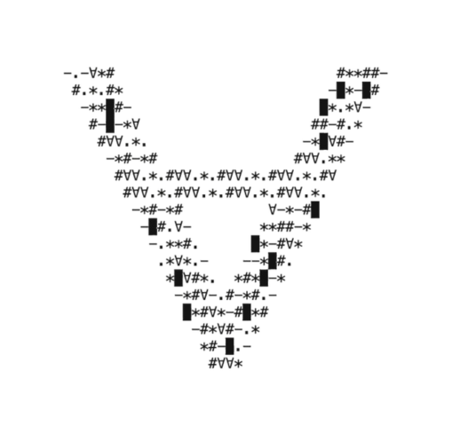
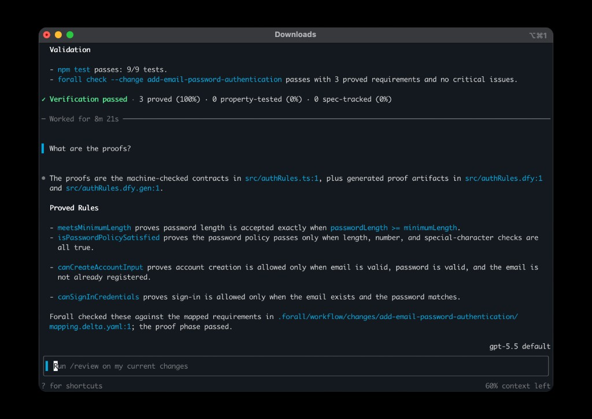

<div align="center">

<picture>
  <source media="(prefers-color-scheme: dark)" srcset="assets/forall-dark.png" />
  <source media="(prefers-color-scheme: light)" srcset="assets/forall-light.png" />
  
</picture>

<h1>Forall</h1>

<p>A coding agent for spec-driven development and verification.</p>

<p>
  <a href="./LICENSE"></a>
  <a href="https://discord.com/invite/gESuZkdD5R"></a>
</p>



</div>

This repository distributes the **Forall CLI** (prebuilt binaries), documentation, and community assets. The agent source is not published here.

## Install

```bash
curl -fsSL https://raw.githubusercontent.com/astrio-ai/forall/main/install.sh | bash
```

Add `~/.local/bin` to your `PATH` if needed, then run `forall --version`.

> **Note:** A binary release must exist on [GitHub Releases](https://github.com/astrio-ai/forall/releases) before install succeeds.

## License

Apache-2.0 — see [LICENSE](LICENSE). Prebuilt binaries may be subject to separate product terms.
