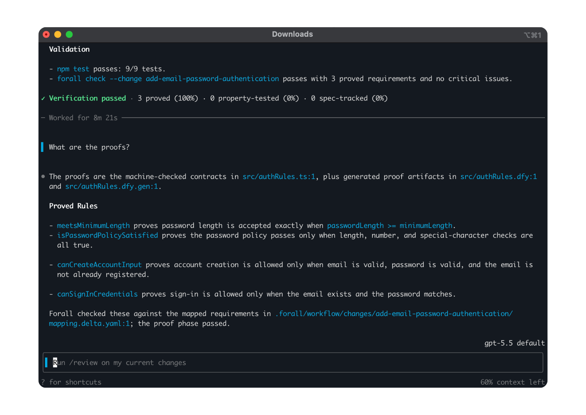

<div align="left">

<h1>Forall</h1>

<p>Forall is a coding agent from Astrio that helps developers build correct software by generating code alongside machine-checkable proofs.</p>

<p>
  <a href="./LICENSE"></a>
  <a href="https://discord.com/invite/gESuZkdD5R"></a>
</p>



</div>

## Install

```bash
curl -fsSL https://raw.githubusercontent.com/astrio-ai/forall/main/install.sh | bash
```

Add `~/.local/bin` to your `PATH` if needed, then run `forall --version`.

> **Note:** A binary release must exist on [GitHub Releases](https://github.com/astrio-ai/forall/releases) before install succeeds.

## Supported programming languages
- TypeScript
- Java
- Rust

We are expanding to our popular programming languages based on the demand.

## Connect us

Join our [Discord](https://discord.com/invite/gESuZkdD5R) and [X](https://x.com/AstrioAI) communities to connect with other developers using Forall. Get help, share feedback, and discuss your projects with the community.

## License

This repository is licensed under the [Apache-2.0 License](LICENSE).
